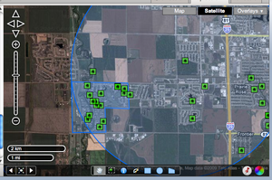

FBS
---

.. _`FBS`: http://www.mlslistingonlinesoftware.com/
.. _`flexmls Web`: http://www.flexmls.com/

`FBS`_ is a Fargo, North Dakota based employee-owned company that creates
software and services for the real estate industry, including its flagship
product `flexmls Web`_.  FBS uses OpenLayers to add value to their web-based
product by delivering highly-interactive maps that also provide a rich amount
of data.

When FBS decided to reinvent their mapping platform, all options were on the
table.  In the end, other popular mapping products proved too inflexible for
the needs of the platform.  In the real estate industry, there are several
required functions for any mapping platform.  We needed to be able to display
aerials, street maps, parcel maps, flood zones, and more, requiring a library
that could work with many different data sources and APIs.  Also, FBS needed to
be able to display a large amount of data that objects via a JavaScript API
couldn't handle.  The ideal solution also had to be flexible enough to allow
the building of additional  mapping features while allowing the ability to
change directions in the future if necessary.  OpenLayers met all these
requirements.

FBS began their mapping transformation by creating a map tile infrastructure to
feed OpenLayers.  Utilizing MapServer, they were able to generate custom tile
caches that display more detailed information like tax parcel boundaries,
Multiple Listing Service regions, client-specific area information and more.
If FBS clients have geospatial data, it is possible to generate maps to reflect
it and OpenLayers will be more than happy to serve them up.

Many of the mapping APIs out there are the equivalent of an interface
straightjacket.  With OpenLayers, there is unparalleled control over the
mapping interface, both in appearance and functionality.  The FBS map interface
has an unique look all its own, instead of appearing to be another "me too"
map.  In addition, it is possible to extend OpenLayers to provide custom UI
tools for the applications as needed.

.. _`DM Solutions Group`: http://www.dmsolutions.ca/

With their partners at `DM Solutions Group`_, FBS was able to
capitalize on existing OpenLayers tools like vector-based drawing, layer
management, popups and rulers.  With complete control over the tools, FBS can
change their behavior and connect them to custom services, which they can roll
to our specifications.  Combining several of the above client-side tools and
our server-side services, FBS created a few of tools that offer killer
application-specific features without ever resorting to hacking a closed,
obfuscated API.  The result is a mapping application that works the way it
needs to, instead of being another feature request in the queue of a giant
company.

.. image:: _static/fbs2.png
  :align: left

With the large numbers of properties inside the flexmls Web system, the
FBS mapping solution needed to allow clients to see everything in their
area, not just the McNuggets.  Using some server-side code and MapServer, a
custom rendered overlay displaying all the data in an area can be rendered and
displayed via OpenLayers quickly and efficiently.  Because OpenLayers accepts
so many different formats of data, the sky is the limit regarding creative ways
to solve big, hairy data issues.  This translates to panning and zooming that
provide mapping updates quickly, not possible with JavaScript APIs that have to
manage all those points of interest on the end-user's web browser.

Another giant upside to OpenLayers is the flexibility it provides in an
uncertain future.  Because OpenLayers relies on open protocols, it can be
configured to grab mapping data from a variety of sources.  In areas of the
country where purchasing high quality aerial imagery is out of the question,
it is possible to configure OpenLayers to display satellite maps from Google.
This provides an economical alternative for customers who have access to
imagery only at high costs or live in rural areas where excellent coverage is
simply not available.  This also aids various international clients where
reliable geographic data can be limited.  If other mapping providers offer a
mapping service that FBS doesn't have, the nature of OpenLayers allows us to
integrate it without having to go back to the drawing board.

For more information contact:

.. _`Brandon Medenwald`: brandon@fbsdata.com
  
  `Brandon Medenwald`_
  Web Developer, Employee Owner
